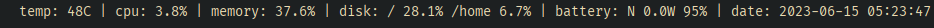

# sbar

**WARNING:** this projet is meant to work on my system. If it doesn't work on yours, hack it.

A hackable, very light-weight, blazingly fast, and print-based status bar.

Can work with [swaybar](https://github.com/swaywm/sway/).

## Gallery

## Building

**Prerequisites:**
  * GNU Make,
  * C++20 compliant compiler, and
  * [Ccache](https://ccache.dev/) or [sccache](https://github.com/mozilla/sccache) (*optional*).

**Steps:**
  1. Just run `make` in the root directory.
  2. The executable should be in the `binary` directory.

## Usage

This is highly compositor-specific.

For [**sway**](https://github.com/swaywm/sway), just add `status_command <path-to-sbar>` in the `bar` scope.
